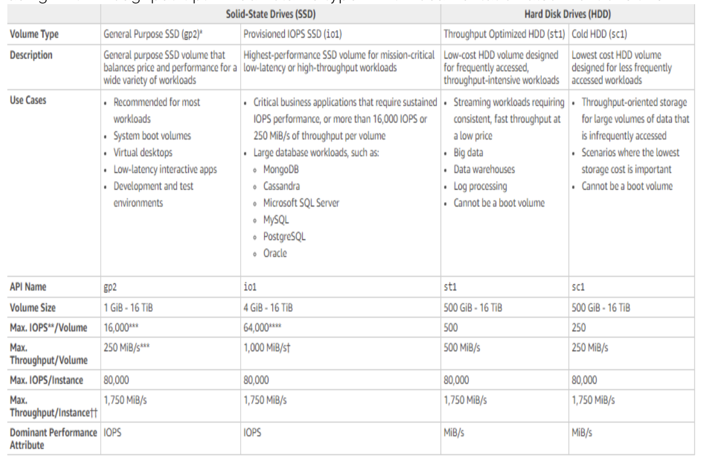

# EC2

**Elastic Compute Cloud (EC2)**  provides resizable compute capacity in the cloud. It takes it minutes to obtain and boot new server instances which makes it easy to scale capacity as required by the computing requirements.

### Pricing Models
1. **On Demand** - fixed rate by the the hour with no commitment.

1. **Reserved** - requires a 1 year or a 3 year contract to reserve capacity. It is heavily discounted when compared to On Demand model.
    * Standard Reserved Instances
    * Convertible Reserved Instances
    * Scheduled Reserved Instances
    
    * Don't get interrupted in the event that there are not enough unused EC2 instances to meet the demand. 

    **Cannot be moved between regions**

1. **Spot** - a bid for instance capacity. Requires time flexibility.

1. **Dedicated Hosts** - a complete, physical server dedicated to you.

Mnemonic for instance types: FIGHT DR MCPXZ AU

[Cheat Sheet](https://tutorialsdojo.com/aws-cheat-sheet-amazon-elastic-compute-cloud-amazon-ec2/)
### EBS
**Elastic Block Store (EBS)** - provides persistent block storage volumes for use with Amazon EC2 instances. Volumes are automatically replicated within its Availability Zone to protect you from component failure, offering high availability and durability.

* Termination protection is **off** by default.

* The default action is for the root EBS volume to be deleted when the instance is terminated.

* EBS Root Volumes and additional volumes of default AMI's can be encrypted. 

* Backup - use snapshots
    * the volume can be used as normal while the snapshit is in progress (snapshots are created asynchronously).

* Types
    1. **General Purpose (SSD)** 
    1. **Provisioned IOPS (SSD)**
    1. **Throughput Optimised Hard Disk Drive**
    1. **Cold Hard Disk Drive**
    1. **Magnetic**

[Cheat Sheet](https://tutorialsdojo.com/aws-cheat-sheet-amazon-ebs/)

### Security Groups
* All inbound traffic is blocked by default.

* All outbound traffic is allowed.

* Changes to Security Groups take effect immediately. 

* Multiple Security Groups may be attached to EC3 instances.

* Stateful - when you open a port it will be open for inbound and outbound traffic.

* You cannot block specific IP addresses using Security Groups. 

* You can specify allow rules but not deny rules.

### AMI Types
**Amazon Machine Image (AMI)** - software configuration for your instance.

* Selection based on:
    1. Region
    1. OS
    1. Architecture
    1. Launch Permissions
    1. Storage for the Root Device
        * Instances Store Volumes - Ephemeral Storage. Cannot be stopped. Data is lost if the host fails.
        * EBS Backed Volumes - data won't be lost if the instance is stopped.
        * Note: both ROOT volumes will be deleted on termination but you can ask AWS to keep the root device volume with EBS.
* Snapshots of encrypted volumes are encrypted automatically.

* Volumes restored from encrypted snapshots are encrypted automatically.

* You can share snapshots, but only if they are unencrypted.

* These snapshots can be shared with other AWS accounts or made public.

* You can now encrypt root device volumes upon creation of the EC2 instance.

* You **cannot** delete a snapshot of an EBS Volume that is used as the root device of a registered AMI.

**How to encrypt root device volumes?**
1. Create a Snapshot of the unencrypted root device volume.
1. Create a copy of the Snapshot and select the encrypt option.
1. Create an AMI from the encrypted Snapshot.
1. Use that AMI to launch new encrypted instances.

### CloudWatch ‼️

**CloudWatch** - monitoring service for your AWS resources and applications. Used to monitor **performance**.

Examples:
* EC2 Instances - by default, monitors events every 5 minutes. Can be increased to 1 min by turning on detailed monitoring. You can create alarms which trigger notifications.
    * Autoscaling Groups
    * Elastic Load Balancers
    * Route53 Health Checks
* Storage & Content Delivery
    * EBS Volumes
    * Storage Gateways
    * Cloud Front
* Host Level Metrics
    * CPU
    * Network
    * Disk
    * Status Check

* Cloud Watch **Metrics** 
    * CPU Utilization - identifies the processing power required to run an application upon a selected instance

    * Network Utilization - identifies the volume of incoming and outgoing network traffic to a single instance

    * Disk Reads - used to determine the volume of the data the application reads from the hard disk of the instance. Can be used to determine the speed of the application

    * Custom metrics you can setup:
        * Memory utilization

        * Disk swap utilization

        * Disk space utilization

        * Page file utilization

        * Log collection

[Cheat Sheet](https://tutorialsdojo.com/aws-cheat-sheet-amazon-cloudwatch/)        

**CloudTrail** - increases visibility into your user and resource activity by recording AWS Management Console actions and API calls. You can identifiy which users and accounts called AWS, the source IP address from which the calls were made, and when the calls occurred. Like a CCTV. Used for **auditing**.

### AWS Config
Typically used for auditing and compliance purposes across organizations to verify whether AWS resource changes being mad are per compliance rules.

### EFS
**Elastic File System** - file storage service for EC2 instances that is easy to use and provides a simple interface. Storage capacity is elastic, growing and shrinking automatically as you add and remove files.

* Using EFS with Microsoft Windows is not supported.

* Using File Gateway is the recommended way to use S3 with shared document pools.

* EFS Lifecycle - used to migrate files that have not been accessed for a certain period of time to IA. Files migrated remain indefinitely. They do not get deleted.

### WAF
**Web Application Firewall** - lets you monitor the HTTP and HTTPS requests that are forwarded to CloudFront, an ALB or API Gateway. Also lets you control access to your content.

* Configure conditions such as what IP addresses are allowed to make this request or what query string parameters need to be passed for the request to be allowed.

* Allows 3 different behaviors: 
    1. Allow all requests except the ones you specify

    1. Block all requests except the ones you specify

    1. Count the requests that match the properties you specify

* Extra protection against web attacks using conditions yo specify. Some conditions:
    * IP addresses that requests originate from

    * Values in request headers

    * Strings that appear in requests, either specific strings or string that match regex patterns
    
    * Length of requests

    * SQL Injection

    * Cross-Site Scripting

### CloudFront
A web service that speeds up distribuition of your static and dynamic web content. 

* Delivers content through a worldwide network of data centers called edge locations.

* User requests are routed to the edge location that provies the lowest latency (time delay).

* If the content is already in the edge location with the lowest latency, it is delivered immediately.

[Cheat Sheet](https://tutorialsdojo.com/aws-cheat-sheet-amazon-cloudfront/)

### EC2 Placement Groups

* Names for your placement groups have to be unique in your AWS account.

* Placement groups can't be merged.

* Existing instances can be moved into a placement group when in a stopped state.

* Moving instances is not possible through the console.

### Types

1. **Clustered Placement Group** - grouping of instances within a single Availability Zone. 
    * Provide low network latency and/or high network throughput. 
    * Not every instance can be launched into a CPG.
    * Can't span multiple Availability Zones.

1. **Spread Placement Group** - group of instances (7 max) in which each is placed on a distinct underlying hardware. **Individual instances.** 
      * Recommended for applications that have a small number of critical instances that should be kept separate from each other.

1. **Partitioned** - EC2 divides each group into logical segments ensuring that each partition (segment) within a placement group has its own set of racks. Each rack has its own network and power source. **Each partition has multiple instances.**

    * You can isolate the impact of hardware failure within your application.

## AWS Shield
Managed Distributed Denial of Service (DDos) protection service that safeguards web applications running on AWS. Provides always-on detection and automatic inline mitigations that minimize application downtime and latency, so there is no need to engage AWS Support to benefit from DDoS protection

* Standard - network and transport layer protection

* Advanced - additional detection and mitigation against large and sophisticated DDoS attacks, nearl real-time visibility into attacks, and integration with WAF.
    * 24/7 access to the AWS DDoS Response Team

[Cheat Sheet](https://tutorialsdojo.com/aws-cheat-sheet-aws-shield/)